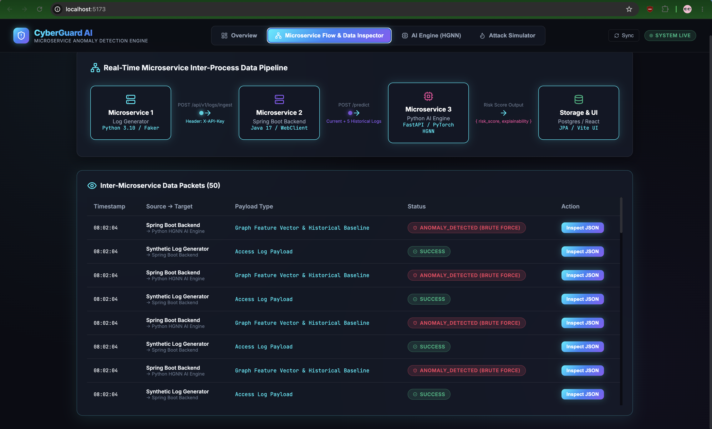
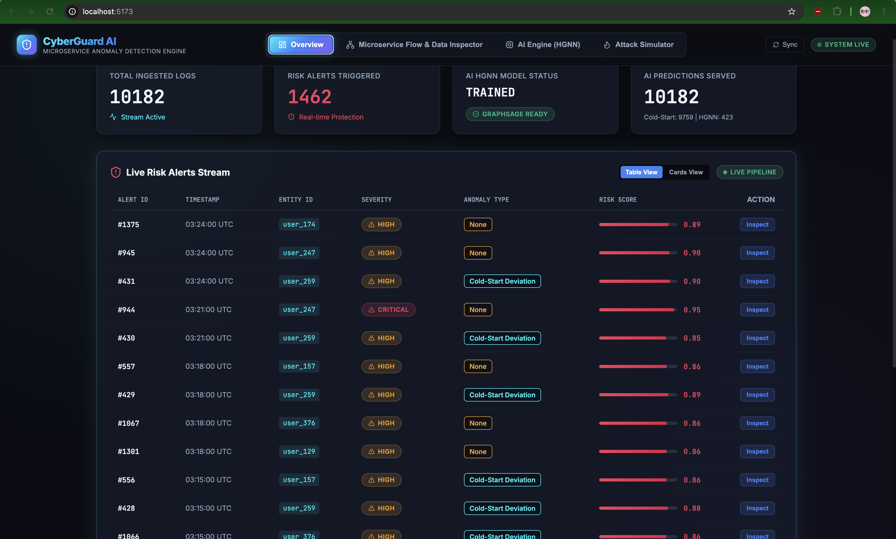
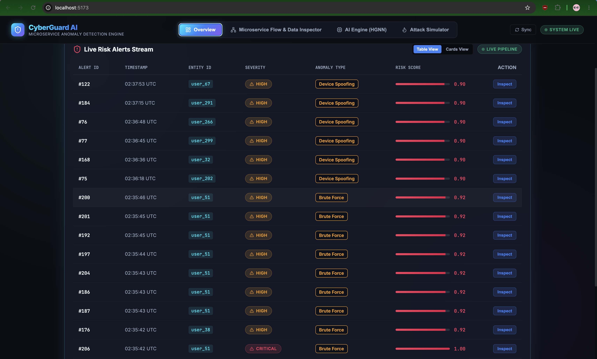
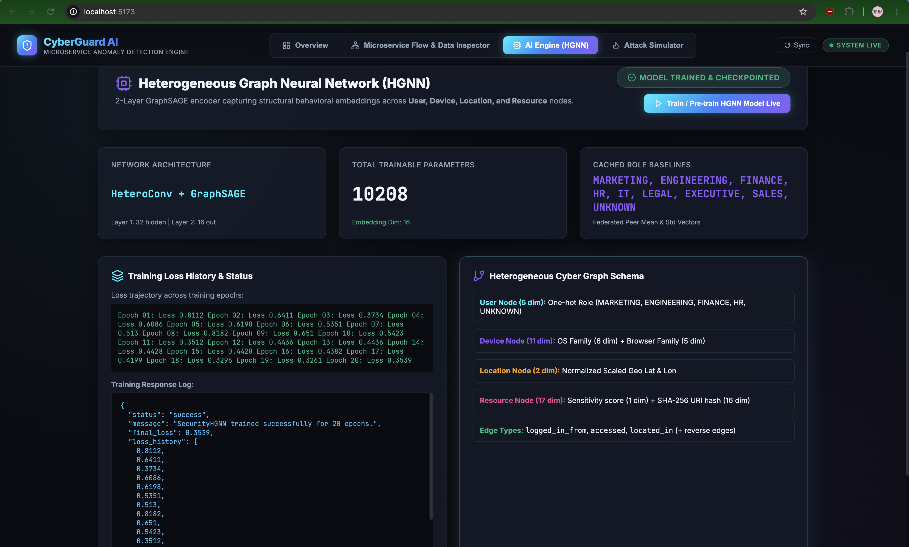
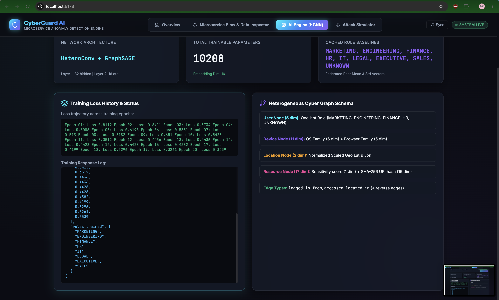
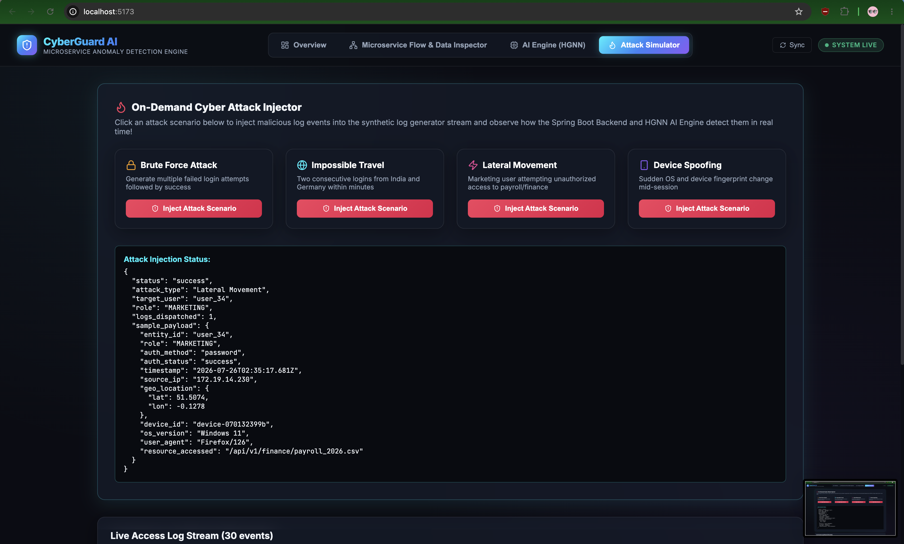
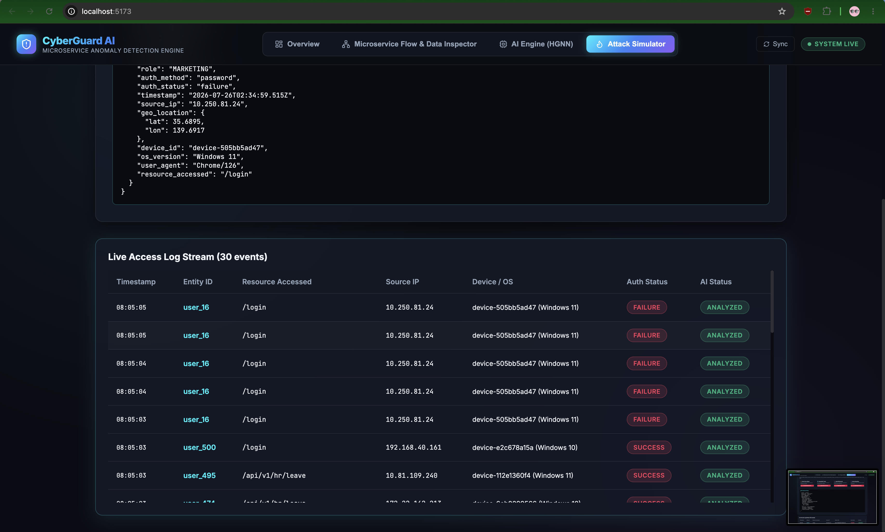
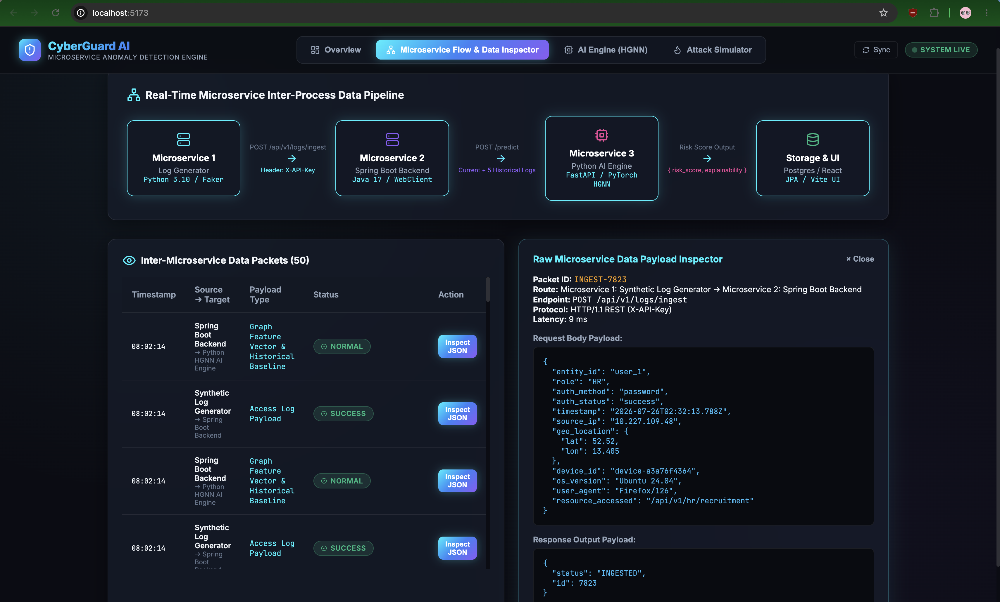

<div align="center">

# 🛡️ CyberGuard AI
### Microservice Anomaly Detection Platform

**Enterprise-grade, real-time cybersecurity threat detection powered by Heterogeneous Graph Neural Networks**


[Overview](#-overview) • [Architecture](#️-system-architecture) • [Live Dashboard](#-live-dashboard) • [Components](#-components-breakdown--directory-structure) • [AI Engine](#-ai-engine--hgnn-internals) • [Attack Simulator](#-attack-simulator) • [Data Contracts](#-security--data-contracts) • [Quick Start](#-quick-start)

</div>

---

## 📖 Overview

**CyberGuard AI** is a complete, end-to-end cybersecurity anomaly detection system built on a distributed microservice architecture. It continuously ingests **synthetic enterprise access logs**, models **user behavioral structure as a heterogeneous graph**, and flags anomalies using a purpose-built **Heterogeneous Graph Neural Network (HGNN)** with **federated cold-start baselines** for new entities — all surfaced in real time on a dark-mode Security Operations Center (SOC) dashboard.

At a glance, the platform is currently:

| Metric | Live Value |
|---|---|
| 📥 Total Ingested Logs | **10,182** — `Stream Active` |
| 🚨 Risk Alerts Triggered | **1,462** — `Real-time Protection` |
| 🧠 AI HGNN Model Status | **TRAINED** — `GraphSAGE Ready` |
| ⚙️ AI Predictions Served | **10,182** *(Cold-Start: 9,759 · HGNN: 423)* |

---

## 🏛️ System Architecture

```
[ Python Synthetic Generator ] ──(HTTP POST /api/v1/logs/ingest)──▶ [ Spring Boot Backend (Port 8080) ]
        │ (Port 8001 Control API)                                              │
        │                                                            (WebClient POST /predict)
        ▼                                                                      ▼
[ Attack Simulator Control ]                                     [ Python AI Engine (Port 8000) ]
                                                                  (FastAPI + PyTorch Geometric)
                                                                              │
                                                                       (REST JSON Response)
                                                                              ▼
[ React + Vite SOC Dashboard (Port 5173) ] ◀──(Polling GET /api/v1/alerts/live)──┘
```

Four services communicate in a closed loop — logs flow in, graph features flow out, and risk scores flow back to the analyst in near real time.

<div align="center">


*Live inter-microservice data pipeline — 50 packets inspected in real time, with brute-force anomalies flagged mid-stream*
</div>

---

## 📊 Live Dashboard

The **Overview** tab is the SOC analyst's home base — system health KPIs up top, a continuously updating risk alert feed below.

<div align="center">

</div>

**Sample live alerts currently in the stream:**

| Alert ID | Entity | Severity | Anomaly Type | Risk Score |
|---|---|---|---|---|
| #944 | `user_247` | 🔴 CRITICAL | — | 0.95 |
| #206 | `user_51` | 🔴 CRITICAL | Brute Force | 1.00 |
| #431 | `user_259` | 🟠 HIGH | Cold-Start Deviation | 0.90 |
| #122 | `user_67` | 🟠 HIGH | Device Spoofing | 0.90 |
| #200 | `user_51` | 🟠 HIGH | Brute Force | 0.92 |
| #430 | `user_259` | 🟠 HIGH | Cold-Start Deviation | 0.85 |

<div align="center">


*Real-time detections: repeated `Device Spoofing` (risk ≈ 0.90) and a `Brute Force` streak on* `user_51` *escalating to a perfect 1.00 risk score*
</div>

---

## 📦 Components Breakdown & Directory Structure

### 1. `subproblem-1_v3/` — Synthetic Cybersecurity Log Generator
Simulates continuous enterprise access logs for **500 entity profiles**, using probabilistic state-machine behavioral transitions and injecting **6 major attack patterns**.

| File | Responsibility |
|---|---|
| `synthetic_log_generator.py` | Main continuous loop streaming logs to Spring Boot via `NetworkDispatcher` |
| `simulation.py` | Simulation runner supporting time acceleration |
| `state_machine.py` | Probabilistic State Machine — `OFFLINE → AUTHENTICATING → ACTIVE_SESSION → IDLE → LOGGED_OUT` |
| `anomaly_injector.py` | Injects Brute Force, Impossible Travel, Lateral Movement, Device Spoofing, Credential Stuffing, Low-and-Slow Exfiltration |
| `control_api.py` | FastAPI control service (port `8001`) triggering on-demand attacks from the React dashboard |

### 2. `anomaly-detection-backend_v2/` — Spring Boot Middle-Layer Orchestrator
Ingests logs, maintains transactional state in PostgreSQL/H2, queries historical context, orchestrates calls to the AI microservice, persists alerts, and exposes secured endpoints to the dashboard.

| Component | Responsibility |
|---|---|
| `IngestionController` | `POST /api/v1/logs/ingest` — secured via `X-API-Key` |
| `DashboardController` | `GET /api/v1/alerts/live`, `/dashboard/stats`, `/dashboard/telemetry`, `/dashboard/logs` |
| `LogProcessingService` | Ingestion, fetches last 5 historical logs per entity, calls AI Engine `POST /predict`, creates a `RiskAlert` when `riskScore > 0.85`, handles retry fallback (`PENDING_ANALYSIS`) |
| `SecurityConfig` & JWT Filters | Dual auth — `ApiKeyAuthFilter` for ingestion, `JwtAuthenticationFilter` for the dashboard |

### 3. `subproblem_3/` — AI Anomaly Detection Engine (FastAPI + PyTorch Geometric)
Heterogeneous Graph Neural Network & Federated Learning microservice on port `8000`.

| File | Responsibility |
|---|---|
| `main.py` | FastAPI server — `POST /predict`, `GET /model/status`, `POST /model/train` |
| `graph_builder.py` | Constructs PyG `HeteroData` graphs (Nodes: User, Device, Location, Resource · Edges: `logged_in_from`, `accessed`, `located_in`) |
| `hgnn_model.py` / `security_hgnn.pt` | 2-layer Heterogeneous Convolutional Network (`HeteroConv` + `SAGEConv`) |
| `anomaly_detector.py` | Structural user-embedding shift (cosine distance) + heuristic checks (Haversine for Impossible Travel) |
| `cold_start.py` / `federated_aggregator.py` | Cold-start users (< 5 historical logs) via role-based Federated Averaging (FedAvg) peer baselines |

### 4. `frontend/` — React + Vite SOC Dashboard
Dark-mode SOC analyst dashboard on port `5173`.

| Tab | Purpose |
|---|---|
| **Overview** | System health, KPI metrics, live alert feed with color-coded severity + explainability |
| **Microservice Flow & Data Inspector** | Interactive live pipeline with raw HTTP payload inspection across all 4 services |
| **AI Engine (HGNN)** | Model architecture, GraphSAGE tensor metadata, 1-click live self-supervised training trigger |
| **Attack Simulator** | On-demand attack injection (Brute Force, Impossible Travel, Lateral Movement, Device Spoofing) + live access log stream |

---

## 🧠 AI Engine — HGNN Internals

<div align="center">

</div>

A **2-layer GraphSAGE encoder** captures structural behavioral embeddings across `User`, `Device`, `Location`, and `Resource` nodes.

| Spec | Value |
|---|---|
| Architecture | `HeteroConv + GraphSAGE` (Layer 1: 32 hidden → Layer 2: 16 out) |
| Trainable Parameters | **10,208** |
| Embedding Dimension | 16 |
| Cached Role Baselines | `MARKETING · ENGINEERING · FINANCE · HR · IT · LEGAL · EXECUTIVE · SALES · UNKNOWN` (Federated Peer Mean & Std vectors) |
| Model State | ✅ `MODEL TRAINED & CHECKPOINTED` |

**Heterogeneous Cyber Graph Schema:**

| Node / Edge | Encoding |
|---|---|
| `User` (5-dim) | One-hot Role |
| `Device` (11-dim) | OS Family (6-dim) + Browser Family (5-dim) |
| `Location` (2-dim) | Normalized, scaled geo lat/lon |
| `Resource` (17-dim) | Sensitivity score (1-dim) + SHA-256 URI hash (16-dim) |
| Edges | `logged_in_from`, `accessed`, `located_in` (+ reverse edges) |

<div align="center">

</div>

**Latest live training run** (triggered via the *"Train / Pre-train HGNN Model Live"* button):

```json
{
  "status": "success",
  "message": "SecurityHGNN trained successfully for 20 epochs.",
  "final_loss": 0.3539,
  "loss_history": [
    0.8112, 0.6411, 0.3734, 0.6086, 0.6198, 0.5351, 0.513,
    0.8182, 0.651, 0.5423, 0.3512, 0.4436, 0.4436, 0.4428,
    0.4428, 0.4382, 0.4199, 0.3296, 0.3261, 0.3539
  ],
  "roles_trained": [
    "MARKETING", "ENGINEERING", "FINANCE", "HR",
    "IT", "LEGAL", "EXECUTIVE", "SALES"
  ]
}
```

---

## 🔥 Attack Simulator

Trigger realistic attack scenarios on demand and watch the Spring Boot backend and HGNN engine detect them live.

<div align="center">

</div>

| Scenario | Description |
|---|---|
| 🔒 **Brute Force Attack** | Multiple failed login attempts followed by a success |
| 🌐 **Impossible Travel** | Two consecutive logins from India and Germany within minutes |
| ⚡ **Lateral Movement** | A Marketing-role user attempting unauthorized access to payroll/finance |
| 📱 **Device Spoofing** | Sudden OS and device-fingerprint change mid-session |

**Example — Lateral Movement injection:**
```json
{
  "status": "success",
  "attack_type": "Lateral Movement",
  "target_user": "user_34",
  "role": "MARKETING",
  "logs_dispatched": 1,
  "sample_payload": {
    "entity_id": "user_34",
    "role": "MARKETING",
    "auth_method": "password",
    "auth_status": "success",
    "timestamp": "2026-07-26T02:35:17.681Z",
    "source_ip": "172.19.14.230",
    "geo_location": { "lat": 51.5074, "lon": -0.1278 },
    "device_id": "device-070132399b",
    "os_version": "Windows 11",
    "user_agent": "Firefox/126",
    "resource_accessed": "/api/v1/finance/payroll_2026.csv"
  }
}
```

<div align="center">

</div>

**Example — Impossible Travel injection** *(London → New Delhi in minutes):*
```json
{
  "status": "success",
  "attack_type": "Impossible Travel",
  "target_user": "user_40",
  "role": "MARKETING",
  "logs_dispatched": 2,
  "sample_payload": {
    "entity_id": "user_40",
    "role": "MARKETING",
    "auth_method": "password",
    "auth_status": "success",
    "timestamp": "2026-07-26T02:35:13.185Z",
    "source_ip": "192.168.232.113",
    "geo_location": { "lat": 28.6139, "lon": 77.209 },
    "device_id": "device-3360705024",
    "os_version": "Windows 11",
    "user_agent": "Chrome/126",
    "resource_accessed": "/api/v1/dashboard"
  }
}
```

<div align="center">


*Live access-log stream capturing a brute-force run — repeated* `FAILURE` *auth attempts on* `user_16` *from a single device before the AI engine flags it*
</div>

---

## 🔍 Microservice Flow & Payload Inspection

Every packet crossing service boundaries can be inspected live, down to the raw HTTP payload.

<div align="center">

</div>

**Example — captured ingestion packet `INGEST-7823`:**

| Field | Value |
|---|---|
| Route | Synthetic Log Generator → Spring Boot Backend |
| Endpoint | `POST /api/v1/logs/ingest` |
| Protocol | `HTTP/1.1 REST (X-API-Key)` |
| Latency | `9 ms` |

```json
// Request Body Payload
{
  "entity_id": "user_1",
  "role": "HR",
  "auth_method": "password",
  "auth_status": "success",
  "timestamp": "2026-07-26T02:32:13.788Z",
  "source_ip": "10.227.109.48",
  "geo_location": { "lat": 52.52, "lon": 13.405 },
  "device_id": "device-a3a76f4364",
  "os_version": "Ubuntu 24.04",
  "user_agent": "Firefox/126",
  "resource_accessed": "/api/v1/hr/recruitment"
}
```
```json
// Response Output Payload
{
  "status": "INGESTED",
  "id": 7823
}
```

---

## ⚡ Quick Start

Launch all four microservices simultaneously with the root unified orchestrator:

```bash
python run_all.py
```

### Individual Service Ports & URLs

| Service | URL |
|---|---|
| 🖥️ React Frontend (SOC Dashboard) | `http://localhost:5173` |
| ☕ Spring Boot Backend | `http://localhost:8080/api/v1/alerts/live` |
| 🧠 AI Engine Docs (Swagger) | `http://localhost:8000/docs` |
| 🎛️ Generator Control API | `http://localhost:8001/docs` |

---

## 🔒 Security & Data Contracts

**Ingestion Payload Schema** — *Generator ➔ Spring Boot* (`POST /api/v1/logs/ingest`, secured via `X-API-Key`):

```json
{
  "entity_id": "user_4589",
  "auth_method": "password",
  "auth_status": "success",
  "timestamp": "2026-07-25T08:00:00.000Z",
  "source_ip": "192.168.1.50",
  "geo_location": {
    "lat": 19.0760,
    "lon": 72.8777
  },
  "device_id": "macbook_pro_m2_xyz",
  "os_version": "macOS 14",
  "user_agent": "Chrome/114.0",
  "resource_accessed": "/api/v1/marketing/budget.pdf"
}
```

**Dashboard Live Alert Response Schema** — *Spring Boot ➔ React* (`GET /api/v1/alerts/live`):

```json
[
  {
    "alert_id": 1045,
    "timestamp": "2026-07-25T08:15:00Z",
    "entity_id": "user_4589",
    "risk_score": 0.96,
    "severity": "CRITICAL",
    "anomaly_type": "Lateral Movement",
    "explainability_factors": [
      "Access to /marketing/budget.pdf was 4 standard deviations from normal.",
      "Graph edge probability for this resource is 0.012."
    ]
  }
]
```

---

<div align="center">

**Built with** 🐍 Python · ☕ Java 17 · ⚛️ React + Vite · 🔥 PyTorch Geometric · 🐘 PostgreSQL

*A full-stack demonstration of graph-based behavioral anomaly detection for enterprise SOC teams.*

</div>
